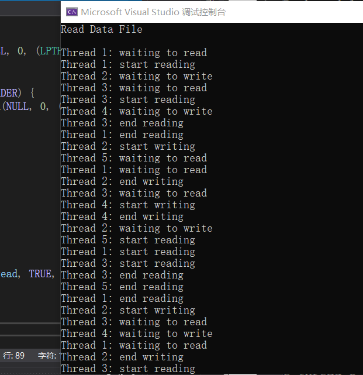

# 实验一 进程同步与互斥

## 实验目的

1. 掌握进程同步和互斥原理，理解生产者-消费者模型；

2. 学习Windows2000/xp中的多线程并发执行机制；

3. 学习使用Windows SDK解决读者－写者问题。

## 实验内容

1. 依据生产者－消费者模型，在Windows环境下创建一个控制台进程，在该进程中创建n个线程模拟生产者和消费者，实现进程(线程)的同步与互斥，分析、熟悉生产者消费者问题仿真的原理和实现技术。学习Windows的线程控制和信号量、临界区工具的使用。
2. 编程解决读者－写者问题的程序。

## 实验过程

1. 根据生产者-消费者模型，对所给程序进行理解。设置缓冲区为3，互斥信号量sem_mutex用于控制生产者和消费者只能有一个人对缓冲区进行操作，设置信号量sem_full和sem_avail为缓冲区为空的数量和缓冲区可用产品的数量。在生产者进行生产时要使空位数量减1即WaitForSingleObject(sem_avail)，在生产结束后令可用产品数加1即ReleaseSemaphore(sem_full)。在消费者要取物品时，对可用的产品减1，取完物品后空位加1

2. 编写读写者问题代码

根据所给的伪码和生产者消费者模型的代码，使用CreateThrea创建写者和读者进程。

